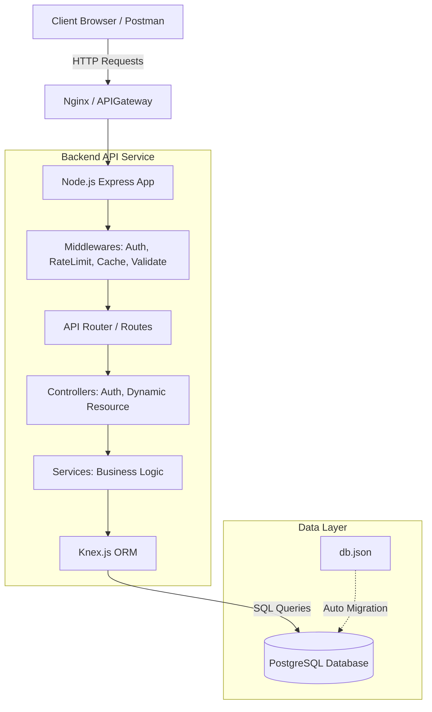

# Smart API Hub

Smart API Hub is a dynamic REST API Platform built with Node.js, Express, and TypeScript. It automatically generates CRUD endpoints based on a provided schema, featuring automated migrations, advanced querying (filtering, pagination, expanded relations), authentication, and global error handling.

## Architecture Diagram

## Prerequisites

- Node.js (version 20 or higher)
- Docker and docker-compose
- PostgreSQL (if running locally without Docker)

## Installation and Setup

### 1. Clone the repository
`git clone https://github.com/thanhannguyxn/smart-api-hub.git`
`cd smart-api-hub`

### 2. Configure Environment Variables
Copy the example environment file:
`cp .env.example .env`
Edit the `.env` file to include your database credentials and application settings.

### 3. Running with Docker Compose
The easiest way to run the application along with the PostgreSQL database:
`docker-compose up -d`

### 4. Running locally (Development mode)
If you prefer running without Docker for the Node application:
`npm install`
`npm run dev`

The server will start on port 3000 (or the port specified in .env).

## Features overview

- Auto-Migration: Automatically generates database tables based on `schema.json`.
- Dynamic CRUD Operations: Supports dynamic routing `/:resource`.
- Advanced Querying: Use `_page`, `_limit`, `_sort`, `_order`, `q` (search), `_embed`, and `_expand`.
- Rate Limiting and Caching: Includes custom middleware to restrict request rates and cache frequent read queries.
- Authentication: Secure endpoints with JWT middleware.

## API Documentation

For the complete API spec, run the server and access the Swagger UI:
`http://localhost:3000/docs`
